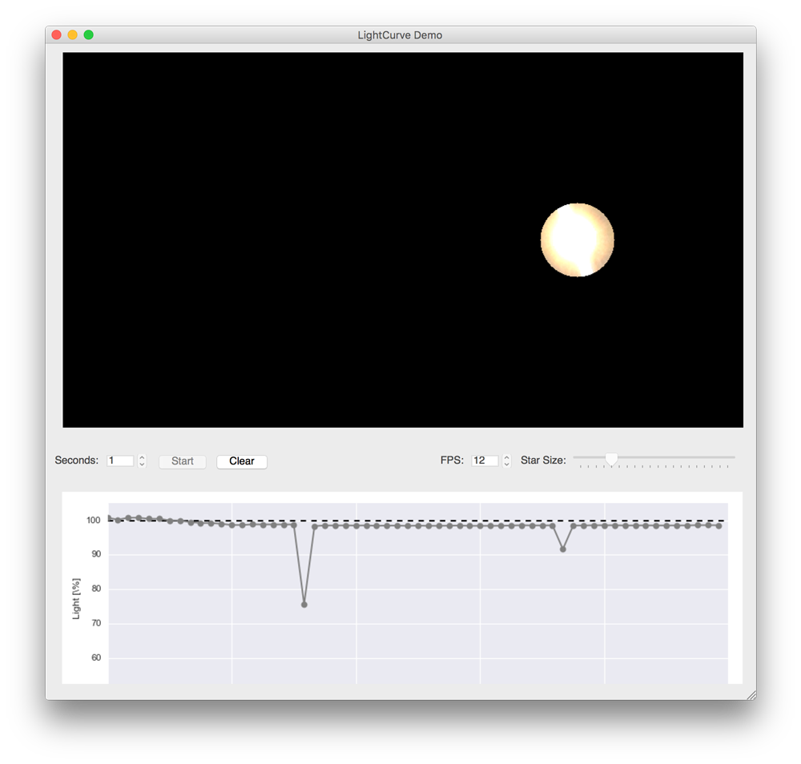

# lightcurve-demo

A small PyQT application that can easily demonstrate how lightcurves are created. Meant as an interactive exhibit.

## Setup

0. Install [Anaconda with Python 3.5](https://www.continuum.io/downloads)
0. Create an environment and install dependencies

       $ conda install pyqt
       $ conda install matplotlib
       $ conda install seaborn
       $ conda install cv2

0. Follow instructions at: [https://conda.anaconda.org/menpo](https://conda.anaconda.org/menpo) to install `opencv3`.

       $ conda install -c https://conda.binstar.org/menpo opencv3

0. Run the demo

       $ python lc-demo.py

## Usage

0. Line up your webcam with a light source.
0. Click 'Start' and move a dark object in front of the light source
0. Observe your awesome light curve :)
=======
# Install

### Python

For ease of install, assumes you are running the latest [Anaconda](https://www.continuum.io/downloads) environment.

### OpenCV

Follow instructions at: https://conda.anaconda.org/menpo to install `opencv3`. 
