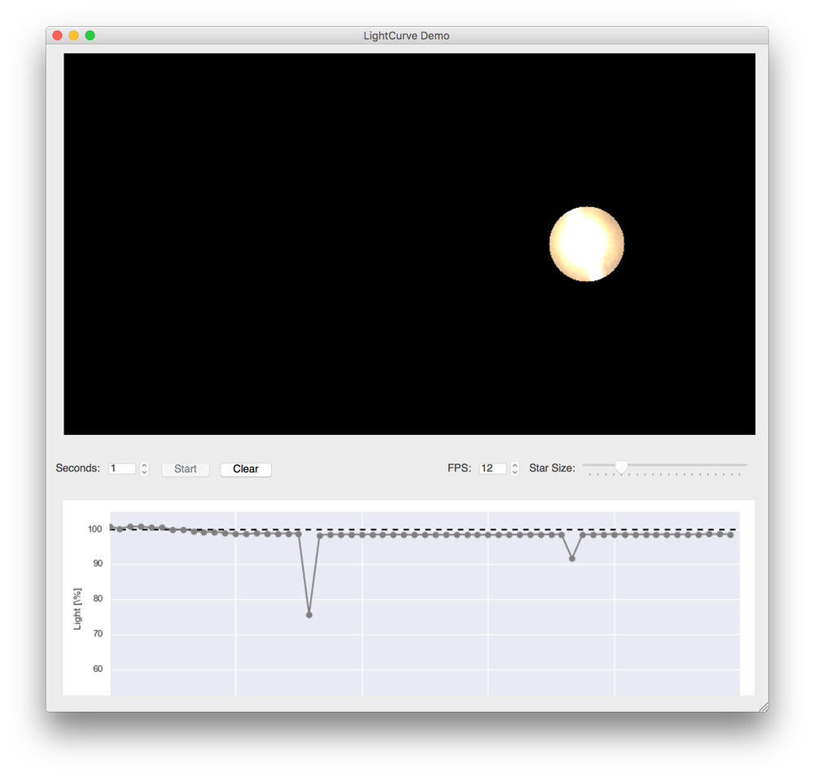

# Lightcurve Demo 🔭

An interactive web exhibit that demonstrates how astronomical lightcurves are created. Point a webcam at a light source, move a dark object in front of it, and watch a real-time lightcurve appear in your browser.



## Quick Start

### 1. Install uv

```bash
curl -Ls https://astral.sh/uv/install.sh | sh
```

Or see the [uv installation docs](https://docs.astral.sh/uv/getting-started/installation/) for other methods.

### 2. Clone and run

```bash
git clone https://github.com/panoptes/lightcurve-demo.git
cd lightcurve-demo
uv sync
uv run streamlit run lc_demo.py
```

Then open [http://localhost:8501](http://localhost:8501) in your browser.

---

## Usage

1. **Connect a webcam** and line it up with a bright light source.
2. Use the **sidebar** to configure:
   - **Video device index** — `0` for the default webcam (`/dev/video0`), `1` for a second device, etc.
   - **Duration** — how many seconds to record the lightcurve.
   - **Aperture radius** — size of the circular region used to measure light.
   - **Show colour channels** — toggle between RGB and greyscale photometry.
   - **Save snapshot** — capture a PNG at the recording midpoint (downloadable after the run).
3. Click **▶ Start** and move a dark object slowly in front of the light source.
4. Watch the lightcurve build in real time!
5. Click **✕ Clear** to reset and record again.

---

## How it works

The app captures webcam frames with [OpenCV](https://opencv.org/) and applies a circular aperture mask centred on the frame. The total pixel flux inside the aperture is measured for each frame and normalised to the baseline reading at the start of the recording. This mirrors the aperture photometry technique used in real astronomical lightcurve measurements.

---

## Kiosk / Exhibit Mode

For a full-screen exhibit experience:

1. Run the app as above.
2. Open the browser in full-screen mode (`F11`).
3. Use Streamlit's built-in "wide" layout (already configured) for maximum canvas space.

To have the app auto-restart on completion, use Streamlit's `--server.runOnSave` flag or simply enable **Loop Mode** by clicking Start again after each run.

---

## Requirements

- Python ≥ 3.11
- A webcam accessible as `/dev/video0` (or another index)
- Dependencies are managed via `pyproject.toml` and installed automatically by `uv sync`:
  - `streamlit` — web UI
  - `opencv-python` — webcam capture and image processing
  - `plotly` — interactive lightcurve charts
  - `numpy` — numerical operations

---

## Development

```bash
# Install dev tools and run linter
uv sync
uv run ruff check .
uv run ruff format .
```

---

## License

Apache 2.0 — see [LICENSE](LICENSE).
